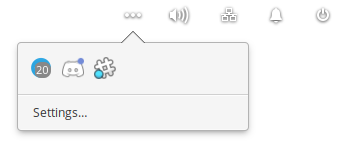

#  Wingpanel Namarupa Indicator



## Name Inspiration

The name Namarupa is used for the forces at play that govern the Ayatana, in Buddhism. Since this indicator manages the system tray icons which are under the Ayatana project, it seems clever to name this Namarupa.

## Before Installation

Version odin (eos6) you need indicator-application:

```bash
sudo apt-get install indicator-application
```

(All versions)You need to add Pantheon to the list of desktops abled to work with indicators:  

- With autostart (thanks to JMoerman)  

System settings -> "Applications" -> "Startup" -> "Add Startup App…" -> "Type in a custom command"

Add /usr/lib/x86_64-linux-gnu/indicator-application/indicator-application-service as custom command to the auto start applications in the system settings  

- With a terminal 
Open Terminal and run the following commands.
<pre>mkdir -p ~/.config/autostart
cp /etc/xdg/autostart/indicator-application.desktop ~/.config/autostart/
sed -i 's/^OnlyShowIn.*/OnlyShowIn=Unity;GNOME;Pantheon;/' ~/.config/autostart/indicator-application.desktop
</pre><br/>
 

### Easy install for users

Install the latest debian file :

- Hera(eos5) and previous: <a href="https://github.com/Lafydev/wingpanel-indicator-namarupa/blob/master/com.github.donadigo.wingpanel-indicator-namarupa_1.0.0_amd64.deb">com.github.*amd_64.deb </a>
- Odin(eos6): <a href="https://github.com/Lafydev/wingpanel-indicator-namarupa/blob/master/com.github.donadigo.wingpanel-indicator-namarupa_1.0.3_odin.deb">com.github.*odin.deb </a>
  try a double-click or use GDebi or dpkg :
  <pre>sudo dpkg -i ./com.github.donadigo.wingpanel*.deb</pre>
 
Easy uninstall after easy install:
<pre>sudo dpkg -r com.github.donadigo.wingpanel-indicator-namarupa</pre>
reboot or kill wingpanel
  

### For developers

You'll need the following dependencies:

```bash
sudo apt-get install libglib2.0-dev libgranite-dev libindicator3-dev 
valac gcc meson
```

- Version Hera(eos5) and previous :  
  
  ```bash
  sudo apt-get install libwingpanel-2.0-dev
  ```

- Version odin(eos6) : 
  
  ```bash
  sudo apt-get install libwingpanel-dev 
  ```

Run meson to configure the build environment and then ninja to build:

```bash
meson build --prefix=/usr && cd build
ninja
```

To install, use ninja install:

```bash
sudo ninja install
```

Reboot or kill wingpanel

To uninstall with ninja:
Open a terminal in the build folder.
<pre>sudo ninja uninstall</pre>
Version Hera(5) and previous:  <pre>killall wingpanel</pre>
Version Odin(6): <pre>killall io.elementary.wingpanel</pre>
